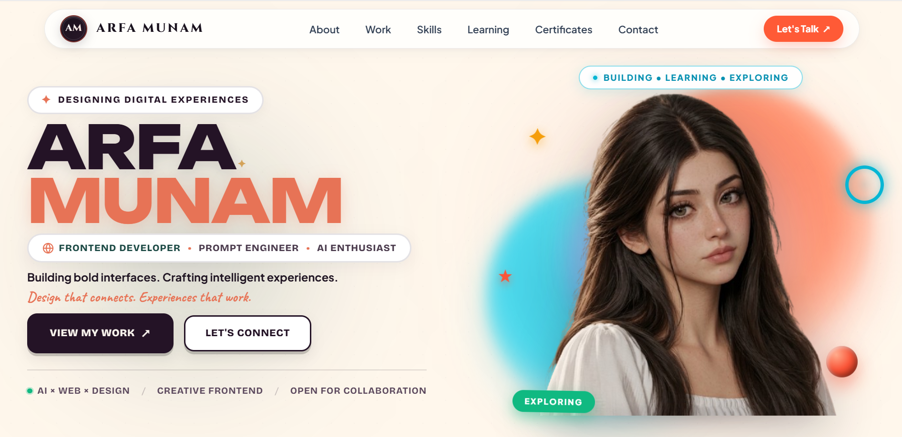

<!-- ======= HERO SECTION ================== -->

<h1 align="center">
  Hello, I'm <strong>𝐀𝐫𝐟𝐚 𝐌𝐮𝐧𝐚𝐦</strong> 👋
</h1>

Building intelligent software with elegant design.

   

   

  
  

## 👨‍💻 About Me

| | |
|:---|:---|
| 🎓 **Education** | BS Computer Science Student |
| 💼 **Specialization** | Frontend Development & Modern UI Engineering |
| 🚀 **Currently Learning** | Backend Development • MERN Stack • AI Automation • System Design |
| 💡 **Passionate About** | Building scalable, user-focused, and AI-powered web applications |
| 🤝 **Open To** | Internships • Freelance • Open Source • Collaboration |
| 🎯 **Goal** | Becoming a Full Stack Software Engineer building impactful AI products |

## ⚡ Engineering Principles

| | |
|:--|:--|
| 💻 | **Clean, scalable, and maintainable code** |
| 🎨 | **Thoughtful UI/UX with attention to detail** |
| 🚀 | **Continuous learning and technical growth** |
| 🧩 | **Practical problem solving** |
| 🤝 | **Open collaboration and knowledge sharing** |
| 🎯 | **Building products with real-world impact** |

# Featured Projects

### StudyPilot AI

AI-powered academic companion helping students organize studies, manage assignments, and improve productivity.

**Stack**

React Native • Expo • Supabase • AI

---

### WonderVerse

Interactive 3D educational platform designed to make learning engaging for children.

**Stack**

React • Three.js • GSAP

---

### FounderOS

Premium SaaS landing page inspired by modern startup websites.

**Stack**

React • Tailwind CSS • GSAP

---

### Portfolio Website

Personal portfolio showcasing projects, UI design, animations, and frontend expertise.

---

# Tech Stack

---

# AI & Development Tools

---

# Currently Learning

- React Ecosystem
- Node.js
- Express.js
- MongoDB
- Next.js
- AI Automation
- System Design
- DevOps Fundamentals

---

# GitHub Stats

---
## 🚀 Featured Projects

<table>
<tr>

<td width="50%" valign="top">

<h3 align="center">🍔 Food Landing Page</h3>

Modern restaurant landing page with a clean layout, responsive design, and engaging UI.

</td>

<td width="50%" valign="top">

<h3 align="center">💼 Personal Portfolio</h3>

Luxury-inspired developer portfolio showcasing skills, projects, and achievements.

</td>

</tr>

<tr>

<td width="50%" valign="top">

<h3 align="center">🚀 FounderOS Landing Page</h3>

Premium SaaS landing page built with modern UI, gradients, animations, and responsive layout.

</td>

<td width="50%" valign="top">

<h3 align="center">🛍️ Veloura Store</h3>

Elegant e-commerce landing page featuring a luxury aesthetic and premium shopping experience.

</td>

</tr>
</table>

# Contributions

---

## 💭 Engineering Philosophy

> "Great software is built by solving meaningful problems,
> writing maintainable code,
> and never stopping the pursuit of learning."

# Connect With Me

---

### 🤝 Let's Connect & Build Something Amazing
Feel free to explore my repositories, share feedback, or connect with me on my journey as a developer.

  
  

