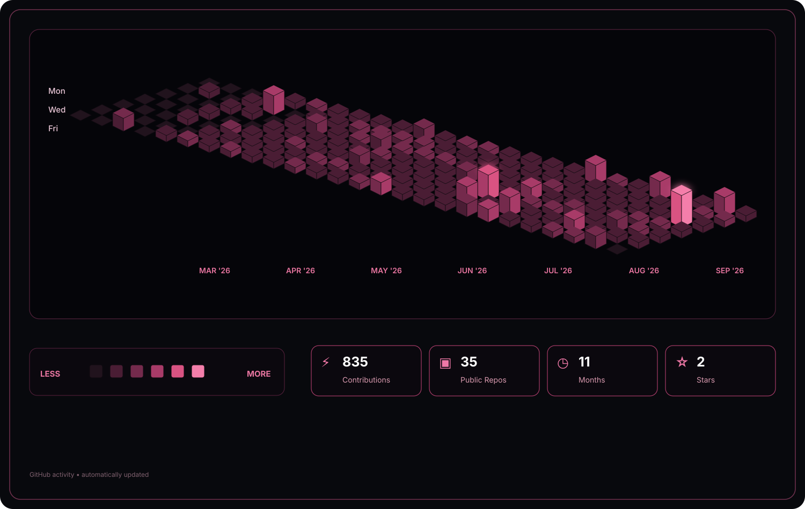

<!-- ======= HERO SECTION ================== -->

<h1 align="center">
  
  Hello, I'm <strong>Arfa Munam | 아르파 무남</strong> 👋
</h1>

  

## 📬 Get In Touch

 
  

  
  &nbsp;&nbsp;
  

## 👨‍💻 About Me

<table align="center">
  <tr>
    <td align="center">🎓</td>
    <td><strong>Education</strong></td>
    <td>BS Computer Science Student</td>
  </tr>

  <tr>
    <td align="center">💼</td>
    <td><strong>Specialization</strong></td>
    <td>Frontend Development & Modern UI Engineering</td>
  </tr>

  <tr>
    <td align="center">🚀</td>
    <td><strong>Currently Learning</strong></td>
    <td>Backend Development • MERN Stack • AI Automation • System Design</td>
  </tr>

  <tr>
    <td align="center">💡</td>
    <td><strong>Passionate About</strong></td>
    <td>Building scalable, user focused, and AI powered web applications</td>
  </tr>

  <tr>
    <td align="center">🤝</td>
    <td><strong>Open To</strong></td>
    <td>Internships • Freelance • Open Source • Collaboration</td>
  </tr>

  <tr>
    <td align="center">🎯</td>
    <td><strong>Goal</strong></td>
    <td>Becoming a Full Stack Software Engineer building impactful AI products</td>
  </tr>
</table>

 

  <strong>Building with curiosity. Learning by creating. Turning ideas into real products.</strong>

# Tech Stack

## 🤖💡 THE DIGITAL EXPERIMENT LAB

  

 

 

&nbsp; ⟶ &nbsp;

&nbsp; ⟶ &nbsp;

&nbsp; ⟶ &nbsp;

&nbsp; ⟶ &nbsp;

  

`01` **THINK**　`02` **BUILD**　`03` **EXPERIMENT**　`04` **REFINE**　`05` **SHIP**

 

 Curiosity → Creation → Iteration → Something Real 🎀

---

## 🌱 Currently Exploring

<table align="center" width="90%">
<tr>

<td width="62%" valign="middle">

⚙️ <strong>Backend Engineering</strong> 
Building reliable APIs and server side systems.

✨ <strong>Vibe Coding</strong> 
Turning ideas into polished products with AI powered workflows.

🤖 <strong>AI Automation</strong> 
Connecting AI, APIs, and intelligent workflows to build smarter applications.

</td>

<td width="38%" align="center" valign="middle">

</td>

</tr>
</table>

 

<!-- ==================== 🔥 GITHUB STREAK ==================== -->

## 🔥GitHub Streak

<table>
<tr>
<td style="border: 1px solid #6B3A4A; border-radius: 18px; padding: 8px; background-color: #17151A;">

</td>
</tr>
</table>

## ⌘ GitHub Journey

  

 ## ⚡ GitHub Statistics

  
  &nbsp;&nbsp;&nbsp;
  

 

 ## 💻 Languages

  
  &nbsp;&nbsp;&nbsp;
  

 ## ✨ Contribution Activity

  

## 🚀 Featured Projects

<table>
<tr>

<td align="center" width="50%">

### 🛋️🎀 PASTEL & FORM

</td>

<td align="center" width="50%">

### 🍜🎈 Kumo Ramen

</td>

</tr>

<tr>

<td align="center" width="50%">

### 🚀✍️ StudyPilot-AI 

</td>

<td align="center" width="50%">

### 🛍️💕 Veloura Store

</td>

</tr>
</table>

## 👌🎀 THE ACTIVITY TRAIL

## 🐍 Contribution Snake Animation

 

## 🎀 THE WAY I BUILD

### 💭 → ✦ **FROM A THOUGHT TO SOMETHING REAL...** 🚀🎈

 

💭 A thought becomes a sketch.
✦ A sketch becomes an interface.
⚡ An interface becomes a product.

And somewhere between **curiosity and obsession,**
I keep refining until it **feels right.**

 

`◌ IMAGINE`  `✦ EXPLORE`  `◈ CREATE`  `⌁ REFINE`  `🚀 RELEASE`

 

Building ideas into experiences, one detail at a time.

 

> **“Leave no good idea unfinished.”**

### 🤝 Let's Connect & Build Something Amazing
Feel free to explore my repositories, share feedback, or connect with me on my journey as a developer.

